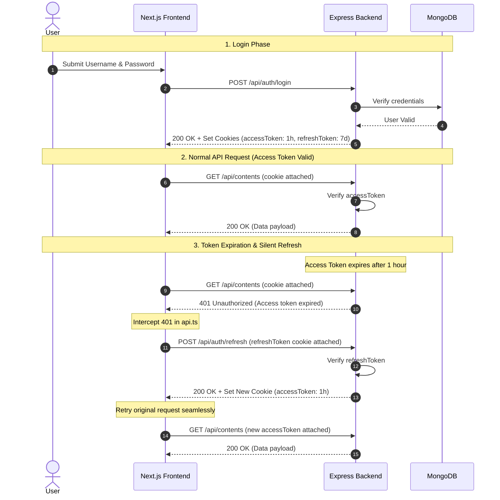

# Understanding JWT Access Tokens & Refresh Tokens: A Step-by-Step Guide

This guide explains how authentication works in your **CMS RBAC application**, specifically detailing the **Access Token** and **Refresh Token** lifecycle between your Express backend (`cms-rbac-server`) and Next.js frontend (`cms-rbac-frontend`).

---

## 1. Core Concepts: Why Two Tokens?

In modern web security, using a single long-lived token (like a 30-day token) is dangerous. If stolen via XSS or network sniffing, an attacker has access for 30 days.

To solve this, authentication uses **two tokens**:

| Token Type | Purpose | Expiration | Stored In |
| :--- | :--- | :--- | :--- |
| **Access Token** | Authorizes everyday API requests (GET, POST, PUT, DELETE). | **Short-lived** (e.g., `1 hour`) | `httpOnly` Cookie |
| **Refresh Token** | Obtains a new Access Token when the short-lived Access Token expires. | **Long-lived** (e.g., `7 days`) | `httpOnly` Cookie |

### Why `httpOnly` Cookies?
- **XSS Protection**: JavaScript code (`document.cookie` or `localStorage`) **cannot read** an `httpOnly` cookie. Even if a malicious script runs on your site, it cannot steal your tokens.
- **Automatic Transmission**: Browsers automatically attach cookies to HTTP requests when `credentials: "include"` is set in `fetch()`.

---

## 2. Authentication Flow Diagram



---

## 3. Backend Implementation (Step-by-Step)

### Step 1: Login & Setting `httpOnly` Cookies
Location: [`cms-rbac-server/src/contollers/auth.js`](file:///home/chheng/project/cms/cms-rbac-server/src/contollers/auth.js#L67-L100)

When a user logs in successfully, the server creates both tokens using `jsonwebtoken` (`jwt.sign`) and sets them as `httpOnly` cookies:

```javascript
// 1. Generate Refresh Token (7 days)
const refreshToken = jwt.sign(payload, process.env.REFRESH_TOKEN_SECRET_KEY, {
  expiresIn: "7d",
});

// 2. Generate Access Token (1 hour)
const accessToken = jwt.sign(payload, process.env.SECRET_KEY, {
  expiresIn: "1h",
});

const cookieSecure = process.env.NODE_ENV === "production";
const cookieSameSite = process.env.NODE_ENV === "production" ? "none" : "lax";

// 3. Set Refresh Token cookie
res.cookie("refreshToken", refreshToken, {
  httpOnly: true,  // Cannot be accessed by client-side JS
  secure: cookieSecure,    // Requires HTTPS in production
  sameSite: cookieSameSite,// Cross-site cookie support for cross-domain hosts
  maxAge: 7 * 24 * 60 * 60 * 1000, // 7 days
  path: "/",
});

// 4. Set Access Token cookie
res.cookie("accessToken", accessToken, {
  httpOnly: true,
  secure: cookieSecure,
  sameSite: cookieSameSite,
  maxAge: 1 * 60 * 60 * 1000, // 1 hour
  path: "/",
});
```

---

### Step 2: Protecting Routes with Middleware
Location: [`cms-rbac-server/src/middlewares/verifyToken.js`](file:///home/chheng/project/cms/cms-rbac-server/src/middlewares/verifyToken.js#L10-L24)

For protected endpoints (e.g., `GET /api/contents` or `GET /api/auth/me`), the backend runs `verifyToken`:

```javascript
// Read token from cookies
const token = req.cookies?.accessToken;

if (!token) {
  return res.status(401).json({ message: "User unauthorized" });
}

// Verify signature and expiration
jwt.verify(token, process.env.SECRET_KEY, (err, decodePayload) => {
  if (err) {
    // If expired or tampered, return 401/403
    return res.status(403).json({ error: "Invalid token" });
  }
  req.user = decodePayload; // Attach user info (id, username, role) to request object
  next(); // Proceed to route controller
});
```

---

### Step 3: Refreshing the Access Token
Location: [`cms-rbac-server/src/contollers/auth.js`](file:///home/chheng/project/cms/cms-rbac-server/src/contollers/auth.js#L192-L238)

When the Access Token expires, the frontend calls `POST /api/auth/refresh`. The server checks the **Refresh Token**:

```javascript
export const refreshToken = async (req, res) => {
  const refreshToken = req.cookies?.refreshToken;

  if (!refreshToken) {
    return res.status(401).json({ message: "Refresh token not found. Please log in." });
  }

  // Verify the Refresh Token using the REFRESH_TOKEN_SECRET_KEY
  jwt.verify(refreshToken, process.env.REFRESH_TOKEN_SECRET_KEY, (err, decoded) => {
    if (err) {
      return res.status(403).json({ message: "Invalid or expired refresh token." });
    }

    const refreshPayload = {
      id: decoded.id,
      username: decoded.username,
      role: decoded.role,
    };

    // Issue a NEW Access Token (valid for 1 more hour)
    const newAccessToken = jwt.sign(refreshPayload, process.env.SECRET_KEY, {
      expiresIn: "1h",
    });

    // Set the updated Access Token cookie
    res.cookie("accessToken", newAccessToken, {
      httpOnly: true,
      secure: process.env.NODE_ENV === "production",
      sameSite: process.env.NODE_ENV === "production" ? "none" : "lax",
      maxAge: 1 * 60 * 60 * 1000,
      path: "/",
    });

    return res.json({ user: { username: refreshPayload.username, role: refreshPayload.role } });
  });
};
```

---

### Step 4: Logging Out
Location: [`cms-rbac-server/src/contollers/auth.js`](file:///home/chheng/project/cms/cms-rbac-server/src/contollers/auth.js#L240-L260)

When logging out, the backend clears both cookies:

```javascript
res.clearCookie("refreshToken", { path: "/" });
res.clearCookie("accessToken", { path: "/" });
res.status(200).json({ message: "Logged out successfully." });
```

---

## 4. Frontend Implementation (Step-by-Step)

### Step 1: Including Credentials in API Calls
Location: [`cms-rbac-frontend/app/lib/api.ts`](file:///home/chheng/project/cms/cms-rbac-frontend/app/lib/api.ts#L77-L83)

Whenever the frontend makes a request, it includes `credentials: "include"` so the browser automatically sends the `httpOnly` cookies:

```typescript
const response = await fetch(`${API_BASE_URL}${path}`, {
  ...options,
  headers,
  credentials: "include", // CRITICAL: Sends httpOnly cookies to backend
  cache: "no-store",
});
```

---

### Step 2: Automatic Silent Retry on 401
Location: [`cms-rbac-frontend/app/lib/api.ts`](file:///home/chheng/project/cms/cms-rbac-frontend/app/lib/api.ts#L87-L97)

If an API call fails with `401 Unauthorized` (because the Access Token expired), the frontend automatically attempts to refresh the token in the background:

```typescript
// First attempt
let response = await doFetch();

// If access token expired (HTTP 401)
if (response.status === 401) {
  try {
    // 1. Ask backend for a new access token using the refresh token cookie
    await refreshAccessToken();
    
    // 2. Retry original request seamlessly without interrupting the user!
    response = await doFetch();
  } catch (err) {
    // If refresh token is also expired (7 days passed), clear local user info
    clearAuth();
    throw new Error("Authentication failed. Please log in again.");
  }
}
```

---

## 5. Key Takeaways & Summary

1. **Short-lived Access Token (1h)** limits the impact if a request is intercepted.
2. **Long-lived Refresh Token (7d)** keeps the user logged in without asking for password every hour.
3. **`httpOnly` Cookies** prevent XSS token theft.
4. **`credentials: "include"`** on frontend ensures cookies are automatically sent with CORS requests.
5. **Silent Refresh Interceptor** in `api.ts` provides a seamless user experience—users stay signed in continuously without page reloads or interruption.
